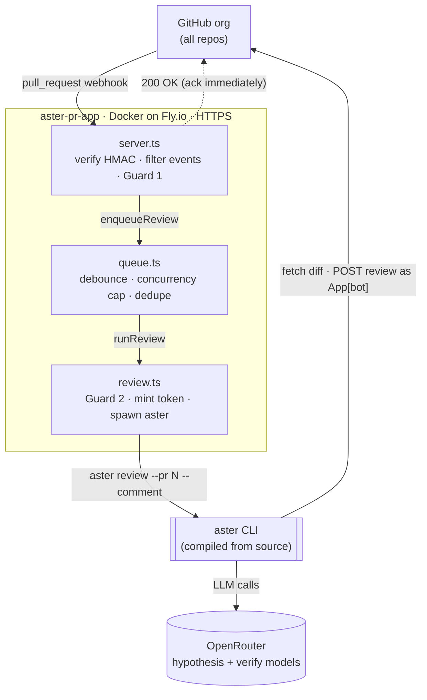
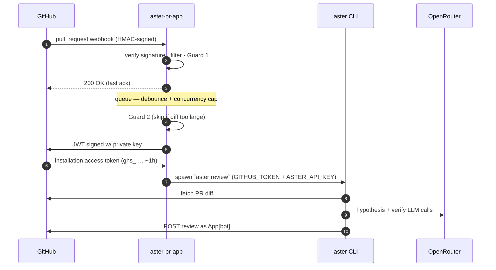

# aster-pr-app

A GitHub App that automatically reviews pull requests across your org using
[aster](https://github.com/Zfinix/aster)'s verification-first review pipeline.

Install it **once** on the org and every repo (present and future) gets reviews —
**no per-repo workflow files**. Reviews are posted as inline PR comments by the
App (`YourApp[bot]`).

## Architecture

The service is deliberately thin: **aster** fetches the diff, runs its pipeline
(hypothesize → retrieve → verify → shape), and posts the review itself. This
service only handles **webhooks, auth, and scheduling** — everything else is aster.



### Runtime & trust flow

Every review hangs off a short-lived **installation token** the App mints from
its private key — that's what lets aster post as `YourApp[bot]`.



### Walkthrough

1. A PR is opened/updated → GitHub POSTs a **signed webhook** to `server.ts`.
2. `server.ts` **verifies the HMAC signature**, drops non-reviewable events
   (drafts, bot authors, and — if disabled — pushes via **Guard 1**), then
   `enqueueReview(...)` and immediately returns `200` so GitHub never times out.
3. `queue.ts` **debounces** rapid pushes into one review, **caps concurrency**,
   and never runs the same PR twice at once.
4. `review.ts` applies **Guard 2** (skip oversized PRs before spending tokens),
   mints an **installation token**, and spawns `aster review …` with the token
   and OpenRouter key in the environment.
5. **aster** fetches the diff, runs the LLM pipeline against OpenRouter, and
   posts the review as the App bot — all in one child process.

### The two cost guards (referenced above)

Reviews cost OpenRouter tokens, so two optional guards keep the bill predictable.
Both **default to current behavior** — you opt in.

- **Guard 1 — `REVIEW_ON_SYNCHRONIZE`** (front door, in `server.ts`): controls
  whether a PR is **re-reviewed every time new commits are pushed**
  (`synchronize`). `true` by default. Set `false` to review each PR **once**
  (on open / reopen / ready-for-review) — the single biggest lever on the bill,
  since it stops one iterative PR from costing many reviews.
- **Guard 2 — `MAX_DIFF_LINES`** (review path, in `review.ts`): **skips** any PR
  whose changed lines (`additions + deletions`) exceed the limit, posting a
  short "too large — please split" note instead of a review. `0` (off) by
  default. This **caps the worst-case cost** of a single review, so one giant or
  machine-generated PR can't run up a big charge.

See [Configuration](#configuration) for how to set them.

> **aster is built from source** in the Docker image (pinned via the `ASTER_REF`
> build arg) because the project publishes no release binaries yet. Bump that SHA
> in the `Dockerfile` to update aster.

---

## 1. Create the GitHub App (org admin — one time)

Org **Settings → Developer settings → GitHub Apps → New GitHub App**.

| Field | Value |
|---|---|
| **Name** | e.g. `aster-review` (this becomes the `[bot]` name on comments) |
| **Homepage URL** | anything, e.g. your repo URL |
| **Webhook → Active** | ✅ checked |
| **Webhook URL** | `https://<your-host>/api/github/webhooks` (fill in after deploy — you can edit it later) |
| **Webhook secret** | generate a random string; save it as `GITHUB_WEBHOOK_SECRET` |

**Repository permissions:**

| Permission | Access | Why |
|---|---|---|
| Pull requests | **Read & write** | fetch the PR, post the review |
| Contents | **Read** | aster reads file context for the diff |
| Metadata | **Read** | mandatory |

**Subscribe to events:** ✅ **Pull request**

**Where can this App be installed?** → *Only on this account* (your org).

Click **Create**. Then on the App page:

- **App ID** → save as `GITHUB_APP_ID`.
- **Private keys → Generate a private key** → downloads a `.pem` → this is
  `GITHUB_APP_PRIVATE_KEY`.
- **Install App → Install** on your org → choose **All repositories** (this is
  what makes it org-wide with zero per-repo setup).

---

## 2. Deploy to Fly.io

Install [flyctl](https://fly.io/docs/flyctl/install/), then from this folder:

```bash
fly launch --no-deploy        # claim an app name + region; keep the provided fly.toml
```

Set the secrets (the private key is base64-encoded so it survives a single-line
secret store):

```bash
fly secrets set \
  GITHUB_APP_ID=123456 \
  GITHUB_WEBHOOK_SECRET='the-secret-you-set-above' \
  OPENROUTER_API_KEY='sk-or-...' \
  GITHUB_APP_PRIVATE_KEY="$(base64 -i your-app.private-key.pem | tr -d '\n')"
```

Optionally override models / behavior (defaults live in `.env.example`):

```bash
fly secrets set \
  ASTER_HYPOTHESIS_MODEL=openai/gpt-4o-mini \
  ASTER_VERIFY_MODEL=anthropic/claude-sonnet-4 \
  MIN_CONFIDENCE=0.6
```

Deploy:

```bash
fly deploy
```

Grab the URL (`https://<app>.fly.dev`) and put
`https://<app>.fly.dev/api/github/webhooks` back into the App's **Webhook URL**.

> **Note:** `fly.toml` sets `auto_stop_machines = false` / `min_machines_running = 1`
> on purpose — reviews run in the background *after* the webhook is acked, so the
> machine must stay up. This means ~1 always-on `shared-cpu-1x` machine of cost.

### Railway alternative
Railway works too: new project → deploy this repo (it uses the `Dockerfile`) →
add the same variables → set the App webhook URL to
`https://<railway-domain>/api/github/webhooks`. Disable sleep/scale-to-zero for
the same background-review reason.

---

## 3. Verify

Open (or push to) a PR in any org repo. Within a minute or two the App posts a
review. Watch logs with `fly logs`. Health check: `GET /health` → `ok`.

---

## Configuration

All config is env vars — see [`.env.example`](.env.example). Key ones:

- `ASTER_HYPOTHESIS_MODEL` — cheap model that drafts candidate findings.
- `ASTER_VERIFY_MODEL` — stronger model that refutes/verifies each candidate
  before it's posted (this is what keeps noise down).
- `MIN_CONFIDENCE` — raise toward `0.8` if reviews are too chatty.
- `REVIEW_DEBOUNCE_MS` — rapid pushes to the same PR are coalesced into one review.

**Cost guards:**

- `REVIEW_ON_SYNCHRONIZE` (default `true`) — set `false` to review each PR only
  once (on open / reopen / ready-for-review) instead of on every pushed commit.
  Biggest single lever on the OpenRouter bill.
- `MAX_DIFF_LINES` (default `0` = off) — skip PRs whose `additions + deletions`
  exceed this, posting a "too large, please split" note instead of a review.
  Caps the worst-case cost of any single review. Try `1500`.

> Model IDs are **OpenRouter slugs** — confirm current names at
> <https://openrouter.ai/models>. The defaults are reasonable starting points,
> not guaranteed-current IDs.

---

## Local development

```bash
cp .env.example .env      # fill in values; paste the raw PEM for GITHUB_APP_PRIVATE_KEY
npm install
npm run dev
```

Expose port 8080 with a tunnel (`cloudflared tunnel --url http://localhost:8080`
or [smee.io](https://smee.io)) and point the App's webhook URL at the tunnel.

You also need the `aster` binary on your PATH. aster has **no published release
binaries yet**, so build it from source (needs Rust 1.85+):

```bash
cargo install --git https://github.com/Zfinix/aster --locked aster-cli
```

Or skip local aster entirely and just run the whole thing in Docker:
`docker compose up --build` (the image compiles aster for you).

---

## Cost model (3 buckets)

1. **Hosting** — ~1 always-on small Fly machine.
2. **OpenRouter tokens** — the actual review work; scales with PR size and the
   hypothesis/verify model choice. This is the main recurring cost.
3. **GitHub** — free; the App itself costs nothing and needs no paid plan.

---

## Scaling & hardening (later)

- **Durable queue:** `src/queue.ts` is in-memory (fine for one instance). For
  multiple instances or crash-safe delivery, swap it for BullMQ + Redis — the
  `enqueueReview` API stays the same.
- **Deeper reviews:** this runs aster in remote `--pr` mode (diff + fetched file
  context, no clone). For whole-repo indexing (aster's SQLite/FTS retrieval),
  add a shallow `git clone` of the PR head before running aster in that dir.
- **Status checks:** optionally add Checks R/W permission and publish a check-run
  so a failed review can block merge.
